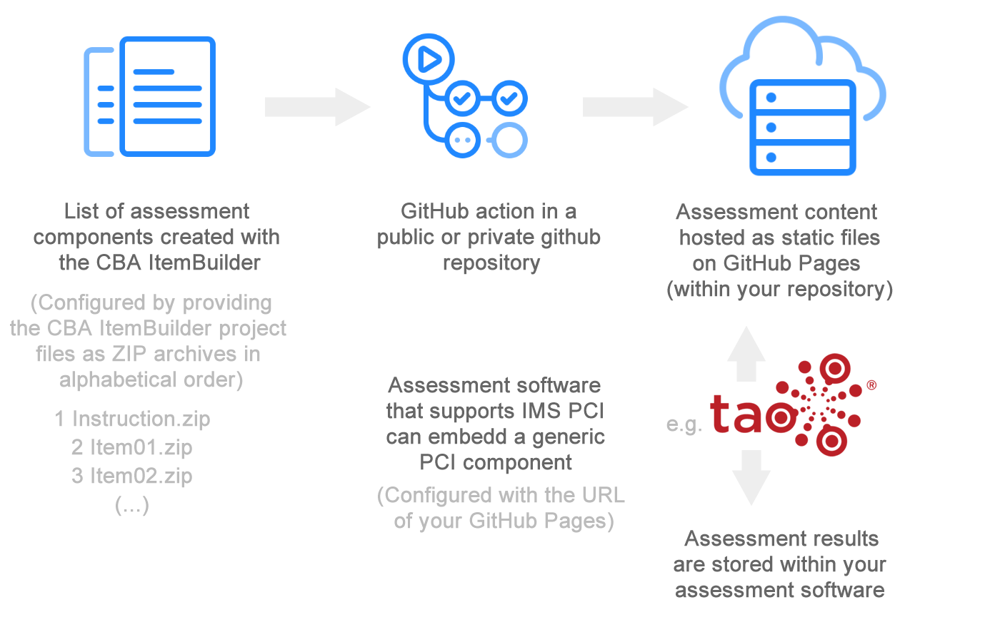

# Welcome to `fastib2pci`

Easy-to-use packaging of [CBA ItemBuilder](https://tba.dipf.de/en/infrastructure/software-development/cba-itembuilder-1) items for computer-based assessments as [Portable Custom Interactions (PCI)](https://www.imsglobal.org/assessment/interactions.html) that can be used in various assessment platforms (e.g., in [TAO](https://www.taotesting.com/)). 

`fastib2pci` uses [GitHub Actions](https://github.com/features/actions) to simplify the process of creating PCI components based on tasks developed as CBA ItemBuidler items. `fastib2pci` can be used to create static deployments for a generic portable custom interaction (PCI) using [GitHub Pages](https://pages.github.com/) to host the assessment content. The static content can also be hosted in other (secure) environments. `fastib2pci` also creates a specific PCI component (containing the assessment content) that does not require any hosting outside the assessment platform that uses the PCI component.

# Usage

1. To use the converter and `fastib2pci` first fork this repository. 

2. Then create a new repository in your GitHub account and use this project as template.

3. Copy the CBA ItemBuilder projects you want to use into the `items/` directory of the repository. 

4. Commit the items to your repository. After that, the Github action processes the content of your items and makes it available for use in a generic PCI component. In parallel, a specific PCI component is also created, which also contains the content of the items, and can be used without additional hosting. 

If multipe CBA ItemBuilder projects are provided in the `items/` directory, rename the ZIP archives to make sure that the order of the files names corresponds to required order of tasks in the test. If a particular item contains multiple tasks, all tasks will be used (as defined within the CBA ItemBuilder). 

# FAQ

- **Q:** Is the assessment content secure, and access restricted when using the generic PCI component and `fastib2pci`? **A:** No! The content will be available and accessible for everyone knowing the name of your GitHub project by calling the URL `https://[user name].github.com/[reponame]` (see, for instance, https://dipftba.github.io/fastib2pci/). Hence, you need to keep the `[reponame]` private to achieve some level of protection. If this is not sufficient, don't use the generic PCI component of `fastib2pci`.

- **Q:** Are the data secure, and access restricted when using `fastib2pci`? **A:** Yes! For both approaches (using the generic or the specific PCI component), data will be stored within the assessment platform in which the PCI components are embedded. 
 
- **Q:** Do I have to rename the CBA ItemBuilder projects in the CBA ItemBuilder with `Rename Project`, or is it sufficient to name the files in the Explorer / Finder so that the alphabetical order is correct? **A:**  It is enough to rename the project files. The names of the CBA ItemBuilder projects can remain unchanged. 
- **Q:** The `items/` directory already contains files. What do I do? **A:** The sample files are included so that you can see how it works using an example of the [Static Page](https://dipftba.github.io/fastib2pci/). The example data must be deleted, so that these do not come with in the PCI created with `fastib2pci`. 

- **Q:** How performant is the hosting of `fastib2pci`, i.e. how many students can work on the tasks simultaneously?  **A:** The goal of `fastib2pci` is to illustrate how CBA ItemBuilder content can be statically hosted for a generic PCI component. The performance of the GitHub static pages is only one example. If more concurrent testing is required and supported by the assessment platform into which the PCI components are integrated, the content from the `docs\` directory of the `gh-pages` branch can also be used for hosting via a CDN. 