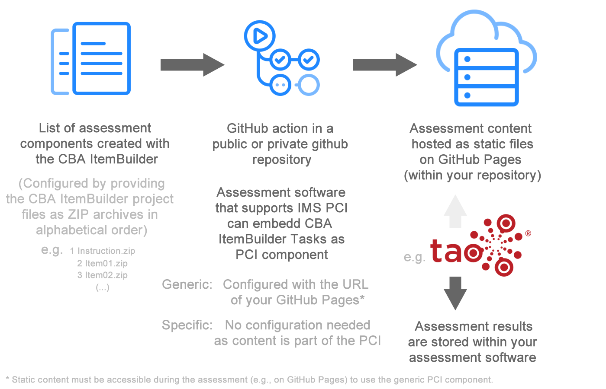

# Welcome to `fastib2pci`

Easy-to-use packaging of [CBA ItemBuilder](https://tba.dipf.de/en/infrastructure/software-development/cba-itembuilder-1) items for computer-based assessments as [Portable Custom Interactions (PCI)](https://www.imsglobal.org/assessment/interactions.html) that can be used in various assessment platforms (e.g., in [TAO](https://www.taotesting.com/)). 

`fastib2pci` uses [GitHub Actions](https://github.com/features/actions) to simplify the process of creating PCI components based on tasks developed as CBA ItemBuidler items. `fastib2pci` can be used to create static deployments for a generic portable custom interaction (PCI) using [Static GitHub Pages](https://pages.github.com/) to host the assessment content. The static content can also be hosted in other (secure) environments. `fastib2pci` also creates a specific PCI component (containing the assessment content) that does not require any hosting outside the assessment platform that uses the PCI component.

# Usage

You will need a [GitHub Account](https://github.com/signup) to use this converter. 

1. To package CBA ItemBuilder items using the PCI converter create a new GithHub repository using `fastib2pci` as template. This will be your repository that uses the [GitHub Actions](https://github.com/features/actions) provided by `fastib2pci` to generate your PCI components. To create a new project based on `fastib2pci`, click **[here](https://github.com/DIPFtba/fastib2pci/generate)** or the button "Use this template", give your repository a name, and decide if the repository should be private or public. Make sure you select **Include all branches**.

2. Add the CBA ItemBuilder zip archives you want to use into the `items/`-directory of the new repository. After that, the the [GitHub Actions](https://github.com/features/actions) will processes the content of your items and makes it available for use in a generic PCI component. In parallel, a specific PCI component is also created, which also contains the content of the items, and can be used without additional hosting. To add CBA ItemBuilder projects you can either upload the files directly using the web interface or clone the git repository, add the files and commit and push the changes. 

3. Download either the generic PCI component or the specific PCI component and embedd the PCI component into your assessment system (e.g., [TAO](https://www.taotesting.com/)). If you use the generic PCI component, configure the PCI by providing the URL to the [Static GitHub Pages](https://pages.github.com/) provided by your fork of this repository. 

If multipe CBA ItemBuilder projects are provided in the `items/` directory, rename the ZIP archives to make sure that the order of the files names corresponds to required order of tasks in the test. If a particular item contains multiple tasks, all tasks will be used (as defined within the CBA ItemBuilder). If your repository is private, the content will be secure until the project name becomes public or known by your test-takers. 

# FAQ

- **Q:** Is the assessment content secure, and access restricted when using the generic PCI component and `fastib2pci`? **A:** No! The content will be available and accessible for everyone knowing the name of your GitHub project by calling the URL `https://[user name].github.com/[reponame]` (see, for instance, https://dipftba.github.io/fastib2pci/). Hence, you need to keep the `[reponame]` private to achieve some level of protection. If this is not sufficient, don't use the generic PCI component of `fastib2pci`.

- **Q:** Are the data secure, and access restricted when using `fastib2pci`? **A:** Yes! For both approaches (using the generic or the specific PCI component), data will be stored within the assessment platform in which the PCI components are embedded. 
 
- **Q:** Do I have to rename the CBA ItemBuilder projects in the CBA ItemBuilder with `Rename Project`, or is it sufficient to name the files in the Explorer / Finder so that the alphabetical order is correct? **A:**  It is enough to rename the project files. The names of the CBA ItemBuilder projects can remain unchanged. 
- **Q:** The `items/` directory already contains files. What do I do? **A:** The sample files are included so that you can see how it works using an example of the [Static Page](https://dipftba.github.io/fastib2pci/). The example CBA ItemBuilder project must be deleted and replaced with your CBA ItemBuilder files, so that these will not be included into the PCI's created with `fastib2pci`. 

- **Q:** How performant is the hosting of `fastib2pci`, i.e. how many students can work on the tasks simultaneously?  **A:** The goal of `fastib2pci` is to illustrate how CBA ItemBuilder content can be statically hosted for a generic PCI component. The performance of the GitHub static pages is only one example. If more concurrent testing is required and supported by the assessment platform into which the PCI components are integrated, the content from the `docs\` directory of the `gh-pages` branch can also be used for hosting via a CDN. 

- **Q:** Which CBA ItemBuilder versions are supported by `fastib2pci`? **A:** The GitHub worker of `fastib2pci` uses [ee4pci](https://github.com/DIPFtba/ee4pci), a simple execution environment for CBA ItemBuilder projects which passes the data to the generic or specific PCI component. The CBA ItemBuilder version supported by [ee4pci](https://github.com/DIPFtba/ee4pci) (newer than 9.6) can also be used by `fastib2pci`. 

- **Q:** Where can I find the static content provided by `fastib2pci` for the generic PCI? **A:** The contents can be found in the `gh-pages` branch. 

- **Q:** Where will the data be stored when I use the PCI components created with `fastib2pci`? **A:** No data is stored in the static page. If the content is integrated into an assessment platform (such as TAO) via the generic or specific PCI component, then the data is stored within the assessment platform (e.g. in TAO). 

- **Q:** How big (pixel width and height) must the CBA ItemBuilder items be created to use them as PIC components with the help of `fastib2pci`? **A:** The embedding of the CBA ItemBuilder item can be configured in the PCI component. If less space is available than needed, the items will be, for instance, scaled-down proportionally if configured. 
